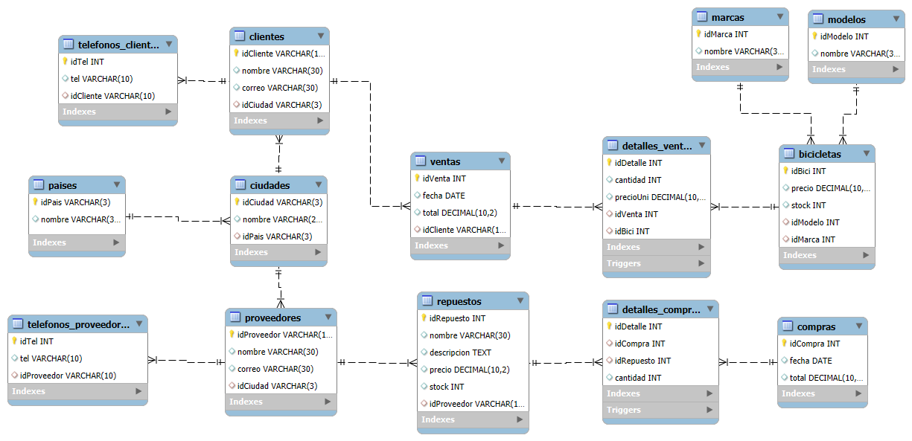

# Campusbike



ELIZABETH PEREZ VALDERRAMA <br>
JOSE DAVID MARTINEZ RICON|

## Caso de Uso 1: Gestión de Inventario de Bicicletas

Descripción: Este caso de uso describe cómo el sistema gestiona el inventario de bicicletas,
permitiendo agregar nuevas bicicletas, actualizar la información existente y eliminar bicicletas que
ya no están disponibles.

### Agregar nueva bicicleta

#### ADD

```sql
INSERT INTO bicicletas ( precio, stock, idModelo, idMarca ) VALUES ( 1400, 140, 1, 2 );
```

#### UPDATE

```sql
UPDATE bicicletas SET precio = 3000, stock = 560, idModelo = 2, idMarca = 3
WHERE idBici = 5;
```

#### DELETE

```sql
DELETE FROM bicicletas WHERE idBici = 4;
```

## Caso de Uso 2: Registro de Ventas

Este caso de uso describe cómo el sistema registra una nueva venta, incluyendo la
creación de la venta y la inserción de los detalles de la venta.

```sql
INSERT INTO ventas(fecha,total, idCliente) VALUES ( '2024-02-10',0, 'C002');
```

```sql
SELECT idVenta FROM ventas WHERE idCliente = 'C002' AND fecha = '2024-02-10';
```

```sql
INSERT INTO detalles_ventas(cantidad, precioUni, idVenta, idBici) VALUES (5, 0,16,5);
```

```sql
SELECT precio FROM bicicletas WHERE idBici = 5;
```

```sql
UPDATE detalles_ventas SET precioUni = 3000 WHERE  idVenta= 16 AND idBici = 5;
```

```sql
UPDATE ventas SET total = 3000*5 WHERE idVenta = 16;
```

### selección de las bicicletas vendidas

### Caso de Uso 3: Proveedores y Repuestos

#### ADD Proveedor

```sql
INSERT INTO proveedores ( idProveedor, nombre, correo, idCiudad) VALUES
("PROV001", "Proveedor 1", "prov1@gmail.com", "TOR" );
```

#### UPDATE Proveedor

```sql
UPDATE proveedores SET nombre = "Proveedor Act", correo = "provact@gmail.com", idCiudad = "MEX"
WHERE idProveedor = "PROV001";
```

#### DELETE Proveedor

```sql
DELETE FROM proveedores WHERE idProveedor = "PROV001";
```

#### ADD Repuesto

```sql
INSERT INTO repuestos ( nombre, descripcion, precio, stock, idProveedor )
VALUES ( "Repuesto 0", "Descripcion Repuesto", 1400.09, 140, "PROV001" );
```

#### UPDATE Repuesto

```sql
UPDATE repuestos
        SET nombre = "Repuesto 1",
        descripcion = "Descripcion del repuesto 1",
        precio = 1250,
        stock = 143,
        idProveedor = "PROV001"
        WHERE idRepuesto = 11;
```

#### DELETE Repuesto

```sql

DELETE FROM repuestos WHERE idRepuesto = 11
```

### Caso de Uso 4: Consulta de Historial de Ventas por Cliente

Descripción: Este caso de uso describe cómo el sistema permite a un usuario consultar el
historial de ventas de un cliente específico, mostrando todas las compras realizadas por el cliente
y los detalles de cada venta.

```sql
SELECT idVenta, fecha, total, idCliente FROM ventas
WHERE idCliente ='C002';
```

```sql
SELECT idDetalle, cantidad, precioUni, idVenta, idBici FROM detalles_ventas
WHERE idVenta IN (2,16);
```

```sql
SELECT idBici, precio, stock, idMarca, idModelo FROM bicicletas
WHERE idBici IN(2,5);
```

### Caso de Uso 5: Compras de Repuestos a Proveedores

```sql
INSERT INTO compras (fecha, total) VALUES ('2024-07-25', 1500.07);
    INSERT INTO detalles_compras (idCompra, idRepuesto, cantidad) VALUES (1, 11, 100);
    UPDATE repuestos SET stock = stock + 100 WHERE idRepuesto = 11;

```

## SUBCONSULTAS

### Caso de Uso 6: Consulta de Bicicletas Más Vendidas por Marca

Descripción: Este caso de uso describe cómo el sistema permite a un usuario consultar las
bicicletas más vendidas por cada marca.

```sql
SELECT idMarca,
		idModelo,
       idBici,
       total_vendido
FROM (
    SELECT idMarca,
			idModelo,
           idBici,
           (SELECT SUM(cantidad)
            FROM detalles_ventas
            WHERE idBici = bicicletas.idBici) AS total_vendido
    FROM bicicletas
) AS ventas_por_bici
WHERE total_vendido = (
    SELECT MAX(total_vendido)
    FROM (
        SELECT idMarca,
               (SELECT SUM(cantidad)
                FROM detalles_ventas
                WHERE idBici = bicicletas.idBici) AS total_vendido
        FROM bicicletas
    ) AS ventas_por_marca
    WHERE ventas_por_marca.idMarca = ventas_por_bici.idMarca
);
```

### Caso de Uso 7: Clientes con Mayor Gasto en un Año Específico

```sql
DELIMITER $$

CREATE PROCEDURE clientes_gastos(
	IN año VARCHAR(4)
)
BEGIN
	SELECT
    idCliente,
    nombre,
    (SELECT SUM(total)
     FROM ventas ven
     WHERE ven.idCliente = c.idCliente
       AND ven.fecha LIKE CONCAT(año, '%')) AS total_gastado
FROM
    clientes c
WHERE (SELECT SUM(total)
     FROM ventas ven
     WHERE ven.idCliente = c.idCliente
     AND ven.fecha LIKE CONCAT(año, '%')) IS NOT NULL
ORDER BY
    total_gastado DESC;
END $$
DELIMITER ;

CALL clientes_gastos('2023');
```

### Caso de Uso 8: Proveedores con Más Compras en el Último Mes

Descripción: Este caso de uso describe cómo el sistema permite consultar los proveedores que
han recibido más compras en el último mes.

```sql
SELECT p.idProveedor, p.nombre,
    (
        SELECT COUNT(c.idCompra)
        FROM compras c
        WHERE c.idCompra IN (
            SELECT dc.idCompra
            FROM detalles_compras dc
            WHERE dc.idRepuesto IN (
                SELECT r.idRepuesto
                FROM repuestos r
                WHERE r.idProveedor = p.idProveedor
            )
        )
        AND c.fecha BETWEEN '2024-07-01' AND '2024-07-31'
    ) AS numero_compras
FROM proveedores p
WHERE p.idProveedor IN (
    SELECT r.idProveedor
    FROM repuestos r
    WHERE r.idRepuesto IN (
        SELECT dc.idRepuesto
        FROM detalles_compras dc
        WHERE dc.idCompra IN (
            SELECT c.idCompra
            FROM compras c
            WHERE c.fecha BETWEEN '2024-07-01' AND '2024-07-31'
        )
    )
)
ORDER BY numero_compras DESC;


```

### Caso de Uso 9: Repuestos con Menor Rotación en el Inventario

```sql
SELECT
	idRepuesto,
    nombre,
    (SELECT SUM(cantidad) FROM detalles_compras det
		WHERE det.idRepuesto = rep.idRepuesto) AS total_comprado
FROM repuestos rep
ORDER BY total_comprado ASC;
```

### Caso de Uso 10: Ciudades con Más Ventas Realizadas

Descripción: Este caso de uso describe cómo el sistema permite consultar las ciudades donde se
han realizado más ventas de bicicletas.

```sql
SELECT c.idCiudad, c.nombre,
    (
        SELECT COUNT(*)
        FROM ventas v
        WHERE v.idCliente IN (
            SELECT cl.idCliente
            FROM clientes cl
            WHERE cl.idCiudad = c.idCiudad
        )
    ) AS cantidad_ventas
FROM ciudades c
ORDER BY cantidad_ventas DESC;
```

## Casos de Uso con Joins

### Caso de Uso 11: Consulta de Ventas por Ciudad

```sql
SELECT
	ciu.idCiudad,
    ciu.nombre,
    COUNT(det.idVenta) as numero_compras
FROM ciudades ciu
INNER JOIN clientes cli ON ciu.idCiudad = cli.idCiudad
INNER JOIN ventas ven ON cli.idCliente = ven.idCliente
INNER JOIN detalles_ventas det ON ven.idVenta = det.idVenta
GROUP BY det.idventa
ORDER BY numero_compras DESC;
```

## Caso de Uso 12: Consulta de Proveedores por País

Descripción: Este caso de uso describe cómo el sistema permite consultar los proveedores
agrupados por país.

```sql
SELECT p.idPais, p.nombre, pr.idProveedor, pr.nombre AS nombre_proveedor
FROM paises p
JOIN ciudades c ON p.idPais = c.idPais
JOIN proveedores pr ON c.idCiudad = pr.idCiudad;
```

### Caso de Uso 13: Compras de Repuestos por Proveedor

```sql
SELECT
	prov.idProveedor,
    prov.nombre,
    COUNT(rep.idRepuesto) as numero_compras
FROM proveedores prov
INNER JOIN repuestos rep ON prov.idProveedor = rep.idProveedor
INNER JOIN detalles_compras det ON rep.idRepuesto = det.idRepuesto
GROUP BY rep.idRepuesto
ORDER BY numero_compras DESC;
```

### Caso de Uso 14: Clientes con Ventas en un Rango de Fechas

Descripción: Este caso de uso describe cómo el sistema permite consultar los clientes que han
realizado compras dentro de un rango de fechas específico.

```sql
SELECT c.idCliente, c.nombre, v.idVenta, v.fecha
FROM clientes c
JOIN ventas v ON c.idCliente = v.idCliente
WHERE v.fecha BETWEEN '2024-07-01' AND '2024-10-30';
```

## PROCEDIMIENTOS

### Caso de Uso 1: Actualización de Inventario de Bicicletas

Descripción: Este caso de uso describe cómo el sistema actualiza el inventario de bicicletas
cuando se realiza una venta.

```sql
DELIMITER $$
CREATE TRIGGER actualizar_stock_bici
AFTER INSERT ON detalles_ventas
FOR EACH ROW
BEGIN
    UPDATE bicicletas
    SET stock = stock - NEW.cantidad
    WHERE idBici = NEW.idBici;
END $$
DELIMITER ;

INSERT INTO detalles_ventas (cantidad, precioUni, idVenta, idBici) VALUES (2, 750.00, 26, 1);
```

### Caso de Uso 2: Registro de Nueva Venta

Descripción: Este caso de uso describe cómo el sistema registra una nueva venta, incluyendo la
creación de la venta y la inserción de los detalles de la venta.

Pirmero creamos una tabla temporal para los detalles de venta ya que necesitamos hacer los cálculos del total en la tabla ventas

```sql
CREATE TEMPORARY TABLE detallesVentasTemp(
    idBici INT,
    cantidad INT,
    precioUni DECIMAL(10,2)
);
```

```sql
INSERT INTO detallesVentasTemp (idBici, cantidad, precioUni) VALUES (1, 2, 500.00);
INSERT INTO detallesVentasTemp (idBici, cantidad, precioUni) VALUES (2, 1, 300.00);
INSERT INTO detallesVentasTemp (idBici, cantidad, precioUni) VALUES (3, 1, 700.00);
```

```sql
DELIMITER $$

CREATE PROCEDURE agregarVenta(
    IN p_fecha DATE,
    IN p_idCliente VARCHAR(10)
)
BEGIN
    DECLARE v_idVenta INT;
    DECLARE v_total DECIMAL(10,2);

    IF(SELECT COUNT(*) FROM clientes WHERE idCliente = p_idCliente) = 0 THEN
    SIGNAL SQLSTATE '45000'
    SET MESSAGE_TEXT = 'El cliente no existe';
    END IF;

    SELECT SUM(cantidad * precioUni) INTO v_total FROM detallesVentasTemp;

    INSERT INTO ventas (fecha, total, idCliente) VALUES (p_fecha, v_total, p_idCliente);

    SET v_idVenta = LAST_INSERT_ID();

    INSERT INTO detalles_ventas (cantidad, precioUni, idVenta, idBici) SELECT cantidad, precioUni, v_idVenta, idBici
    FROM detallesVentasTemp;

    DELETE FROM detallesVentasTemp WHERE idBici IS NOT NULL;

END $$
DELIMITER ;
```

```sql
CALL agregarVenta('2024-07-25','C005');
```

### Caso de Uso 3: Generación de Reporte de Ventas por Cliente

```sql
DELIMITER $$
CREATE PROCEDURE reporte_cliente(
	IN idCliente_cli VARCHAR(10)
)
BEGIN
	SELECT
		cli.idCliente,
        cli.nombre,
        ven.fecha,
        ven.total,
        det.cantidad,
        det.precioUni,
        det.idBici

	FROM clientes cli
    INNER JOIN ventas ven ON cli.idCliente = ven.idCliente
    INNER JOIN detalles_ventas det ON ven.idVenta = det.idVenta
    WHERE cli.idCliente = idCliente_cli;
END $$
DELIMITER ;

CALL reporte_cliente('C001');
```

## Caso de Uso 4: Registro de Compra de Repuestos

Descripción: Este caso de uso describe cómo el sistema registra una nueva compra de repuestos
a un proveedor.

#### Actualizamos stock con un disparador

```sql
DELIMITER $$
CREATE TRIGGER actualizarStock
AFTER INSERT ON detalles_compras
FOR EACH ROW
BEGIN
    UPDATE repuestos
    SET stock = stock + NEW.cantidad
    WHERE idRepuesto = NEW.idRepuesto;
END $$
DELIMITER ;
```

#### Creamos un tabla temporal y la llenamos

```sql
CREATE TEMPORARY TABLE IF NOT EXISTS detallesComprasTemp(
    idRepuesto INT,
    cantidad INT
);

INSERT INTO detallesComprasTemp(idRepuesto, cantidad) VALUES (4,3);
INSERT INTO detallesComprasTemp(idRepuesto, cantidad) VALUES (2,1);
```

```sql
DROP PROCEDURE IF EXISTS insertarCompra;
DELIMITER $$
CREATE PROCEDURE insertarCompra(
    IN p_fecha DATE
)
BEGIN
    DECLARE v_idCompra INT;
    DECLARE v_total DECIMAL(10,2);

    SELECT SUM(dc.cantidad * r.precio) INTO v_total
    FROM detallesComprasTemp dc
    INNER JOIN repuestos r ON dc.idRepuesto = r.idRepuesto;

    INSERT INTO compras(fecha, total) VALUES (p_fecha, v_total);

    SET v_idCompra = LAST_INSERT_ID();
    INSERT INTO detalles_compras(idCompra, idRepuesto, cantidad)
    SELECT v_idCompra, idRepuesto, cantidad FROM detallesComprasTemp;

    DELETE FROM detallesComprasTemp;
END $$
DELIMITER ;
```

```sql
CALL insertarCompra('2024-01-08');
```

### Caso de Uso 5: Generación de Reporte de Inventario

```sql
DELIMITER $$
CREATE PROCEDURE informe_inventario()
BEGIN
SELECT 'Bicicleta:' AS tipo, bi.idBici AS id, bi.precio, bi.stock FROM bicicletas bi
UNION ALL
SELECT 'Repuesto:' AS tipo, re.idRepuesto, re.precio, re.stock FROM repuestos re;
END $$
DELIMITER ;

CALL informe_inventario();
```

### Caso de Uso 6: Actualización Masiva de Precios

Descripción: Este caso de uso describe cómo el sistema permite actualizar masivamente los
precios de todas las bicicletas de una marca específica.

```sql
DELIMITER $$
CREATE PROCEDURE actualizaPrecioMarca(
	IN p_idMarca INT,
    IN p_porcertaje DECIMAL(10,2)
)
BEGIN
	UPDATE bicicletas
    SET precio = precio *(1 + (p_porcertaje/100))
    WHERE idMarca = p_idMarca;

END $$
DELIMITER ;

CALL actualizaPrecioMarca(1,16.00);

```

### Caso de Uso 7: Generación de Reporte de Clientes por Ciudad

```sql
DELIMITER $$
CREATE PROCEDURE clientes_ciudades()
BEGIN
SELECT cli.idCiudad, ciu.nombre, COUNT(*) AS total_clientes
FROM clientes cli
INNER JOIN ciudades ciu ON cli.idCiudad = ciu.idCiudad
GROUP BY cli.idCiudad
ORDER BY total_clientes DESC;
END $$
DELIMITER ;

CALL clientes_ciudades();
```

### Caso de Uso 8: Verificación de Stock antes de Venta

Descripción: Este caso de uso describe cómo el sistema verifica el stock de una bicicleta antes de
permitir la venta.

```sql
DELIMITER $$
CREATE TRIGGER verificarStock
BEFORE INSERT ON detalles_ventas
FOR EACH ROW
BEGIN
	DECLARE v_stock INT;

    SELECT stock INTO v_stock
    FROM bicicletas
    WHERE idBici = NEW.idBici;

    IF NEW.cantidad > v_stock THEN
		SIGNAL SQLSTATE '45000'
		SET MESSAGE_TEXT = 'La cantidad solicitada excede el stock disponible';
    END IF;
END $$
DELIMITER ;
```

### Caso de Uso 9: Registro de Devoluciones

```sql
DELIMITER $$
CREATE PROCEDURE devolver(
	IN idVenta_ven INT
)
BEGIN
UPDATE ventas SET total = 0 WHERE idVenta = idVenta_ven;
UPDATE detalles_ventas SET cantidad = 0, precioUni = 0 WHERE idVenta = idVenta_ven;
END $$
DELIMITER ;

CALL devolver(1);
```

### Caso de Uso 10: Generación de Reporte de Compras por Proveedor

Descripción: Este caso de uso describe cómo el sistema genera un reporte de compras realizadas
a un proveedor específico, mostrando todos los detalles de las compras.

```sql
DELIMITER $$
CREATE PROCEDURE comprasDetalladas()
BEGIN
	SELECT c.idCompra, c.fecha, d.cantidad, r.nombre AS nombre_repuesto,
    p.idProveedor, p.nombre AS nombre_proveedor, c.total
	FROM compras c
	INNER JOIN detalles_compras d ON c.idCompra = d.idCompra
	INNER JOIN repuestos r ON d.idRepuesto = r.idRepuesto
	INNER JOIN proveedores p ON r.idProveedor = p.idProveedor;
END $$
DELIMITER ;

CALL comprasDetalladas();
```

### Caso de Uso 11: Calculadora de Descuentos en Ventas

```sql
DELIMITER $$
CREATE PROCEDURE descuento(
	IN idVenta_ven INT,
    IN descuento_ven INT
)
BEGIN
	UPDATE ventas
    SET total = total * (1 - descuento_ven / 100)
    WHERE idVenta = idVenta_ven;
END $$
DELIMITER ;

CALL descuento(2, 50);
```

## FUNCIONES DE RESUMEN

### Caso de Uso 1: Calcular el Total de Ventas Mensuales

```sql
DELIMITER $$
CREATE PROCEDURE total_ventas_mes()
BEGIN
    SELECT MONTHNAME(fecha) AS mes, SUM(total) as total_mes
	FROM ventas
	GROUP BY mes;
END $$
DELIMITER ;

CALL total_ventas_mes();
```

### Caso de Uso 2: Calcular el Promedio de Ventas por Cliente

Descripción: Este caso de uso describe cómo el sistema calcula el promedio de ventas realizadas
por un cliente específico.

```sql
DELIMITER $$
CREATE PROCEDURE promedioVentasClientes(
	IN p_idCliente VARCHAR(10),
    OUT promedioVentas DECIMAL(10,2)
)
BEGIN

	IF (SELECT COUNT(*) FROM clientes WHERE idCliente = p_idCliente) = 0 THEN
    SIGNAL SQLSTATE '45000'
        SET MESSAGE_TEXT = 'El cliente no existe';
    END IF;

	SELECT AVG(total) INTO promedioVentas
    FROM ventas
    WHERE idcliente = p_idCliente;

END $$
DELIMITER ;

SET @promedioVentas = 0;

CALL promedioVentasClientes('C002', @promedioVentas);

SELECT @promedioVentas AS promedioVentas;
```

### Caso de Uso 3: Contar el Número de Ventas Realizadas en un Rango de Fechas

```sql
DELIMITER $$
CREATE PROCEDURE ventas_rango_fecha(inicio DATE, fin DATE)
BEGIN
    SELECT COUNT(idVenta) AS total FROM ventas
    WHERE fecha BETWEEN inicio AND fin;
END $$
DELIMITER ;

CALL ventas_rango_fecha('2023-01-10', '2023-05-10');
```

### Caso de Uso 4: Calcular el Total de Repuestos Comprados por Proveedor

Descripción: Este caso de uso describe cómo el sistema calcula el total de repuestos comprados a
un proveedor específico.

```sql
DROP PROCEDURE IF EXISTS totalRepuestosProveedor;
DELIMITER $$

CREATE PROCEDURE totalRepuestosProveedor(
    IN p_idProveedor VARCHAR(10)
)
BEGIN

    IF (SELECT COUNT(*) FROM proveedores WHERE idProveedor = p_idProveedor) = 0 THEN
        SIGNAL SQLSTATE '45000'
        SET MESSAGE_TEXT = 'El proveedor no existe';
    END IF;

    SELECT p.idProveedor, p.nombre, SUM(d.cantidad) AS totalRepuestos
    FROM detalles_compras d
    INNER JOIN repuestos r ON d.idRepuesto = r.idRepuesto
    INNER JOIN proveedores p ON r.idProveedor = p.idProveedor
    WHERE p.idProveedor = p_idProveedor
    GROUP BY p.idProveedor, p.nombre;
END $$
DELIMITER ;

CALL totalRepuestosProveedor('P002');


```

### Caso de Uso 5: Calcular el Ingreso Total por Año

```sql
DELIMITER $$
CREATE PROCEDURE calcular_total_año()
BEGIN
SELECT YEAR(fecha) AS año, SUM(total) AS total_año
FROM ventas
GROUP BY YEAR(fecha);
END $$
DELIMITER ;

CALL calcular_total_año();
```

### Caso de Uso 6: Calcular el Número de Clientes Activos en un Mes

Descripción: Este caso de uso describe cómo el sistema cuenta el número de clientes que han
realizado al menos una compra en un mes específico.

```sql
DELIMITER $$
CREATE PROCEDURE totalClientesActivosMesAño(
	IN p_year INT,
    IN p_month INT
)
BEGIN
	SELECT COUNT(DISTINCT idCliente) FROM ventas
	WHERE YEAR(fecha) = p_year AND MONTH(fecha) = p_month;
END $$
DELIMITER ;

CALL totalClientesActivosMesAño(2024, 7);
```

### Caso de Uso 7: Calcular el Promedio de Compras por Proveedor

```sql
DELIMITER $$
CREATE PROCEDURE promedio_proveedor()
BEGIN
SELECT
	prov.idProveedor,
    AVG(comp.total)
FROM compras comp
INNER JOIN detalles_compras det ON comp.idCompra = det.idCompra
INNER JOIN repuestos rep ON det.idRepuesto = rep.idRepuesto
INNER JOIN proveedores prov ON rep.idProveedor = prov.idProveedor
GROUP BY prov.idProveedor
END $$
DELIMITER ;

CALL promedio_proveedor();
```

### Caso de Uso 8: Calcular el Total de Ventas por Marca

Descripción: Este caso de uso describe cómo el sistema calcula el total de ventas agrupadas por
la marca de las bicicletas vendidas.

```sql
DROP PROCEDURE IF EXISTS totalVentasPorMarca;
DELIMITER $$

CREATE PROCEDURE totalVentasPorMarca()
BEGIN
    SELECT COUNT(v.idVenta) AS total_ventas, m.idMarca, m.nombre
    FROM ventas v
    INNER JOIN detalles_ventas d ON v.idVenta = d.idVenta
    INNER JOIN bicicletas b ON d.idBici = b.idBici
    INNER JOIN marcas m ON b.idMarca = m.idMarca
    GROUP BY m.idMarca, m.nombre;
END $$
DELIMITER ;

CALL totalVentasPorMarca();

```

### Caso de Uso 9: Calcular el Promedio de Precios de Bicicletas por Marca

```sql
DELIMITER $$

CREATE PROCEDURE promedio_precio_bici()
BEGIN
    SELECT
        mar.idMarca,
        mar.nombre AS nombre_marca,
        ROUND(AVG(bi.precio), 2) AS promedio_precio
    FROM bicicletas bi
    INNER JOIN marcas mar ON bi.idMarca = mar.idMarca
    GROUP BY mar.idMarca, mar.nombre;
END $$

DELIMITER ;

CALL promedio_precio_bici();
```

### Caso de Uso 10: Contar el Número de Repuestos por Proveedor

Descripción: Este caso de uso describe cómo el sistema cuenta el número de repuestos
suministrados por cada proveedor.

```sql
DELIMITER $$

CREATE PROCEDURE repuestoPorProveedor()
BEGIN
	SELECT COUNT(DISTINCT r.idRepuesto) AS numero_repuestos, p.idProveedor , p.nombre
	FROM repuestos r
	INNER JOIN proveedores p ON r.idProveedor = p.idProveedor
	GROUP BY p.idProveedor;
END $$
DELIMITER ;
CALL repuestoPorProveedor();
```

### Caso de Uso 11: Calcular el Total de Ingresos por Cliente

```sql
DELIMITER $$
CREATE PROCEDURE total_ingresos_cliente()
BEGIN
SELECT cli.nombre, SUM(ven.total) FROM ventas ven
INNER JOIN clientes cli ON ven.idCliente = cli.idCliente
GROUP BY cli.nombre;
END $$
DELIMITER ;

CALL total_ingresos_cliente();
```

### Caso de Uso 12: Calcular el Promedio de Compras Mensuales

Descripción: Este caso de uso describe cómo el sistema calcula el promedio de compras
realizadas mensualmente por todos los clientes.

```sql
DROP PROCEDURE IF EXISTS promedioComprasMensuales;
DELIMITER $$

CREATE PROCEDURE promedioComprasMensuales()
BEGIN
    SELECT AVG(total_compras) AS promedio_mensual
    FROM (
        SELECT COUNT(idCompra) AS total_compras
        FROM compras
        GROUP BY YEAR(fecha), MONTH(fecha)
    ) AS compras_mensuales;
END $$
DELIMITER ;

CALL promedioComprasMensuales();
```

### Caso de Uso 13: Calcular el Total de Ventas por Día de la Semana

```sql
DELIMITER $$
CREATE PROCEDURE total_dias()
BEGIN
SELECT DAYNAME(fecha) AS dia, SUM(total) AS total
FROM ventas
GROUP BY dia;
END $$
DELIMITER ;

CALL total_dias();
```

### Caso de Uso 14: Contar el Número de Ventas por Categoría de Bicicleta

Descripción: Este caso de uso describe cómo el sistema cuenta el número de ventas realizadas
para cada categoría de bicicleta (por ejemplo, montaña, carretera, híbrida).

```sql
DROP PROCEDURE IF EXISTS contarVentasPorCategoria;
DELIMITER $$

CREATE PROCEDURE contarVentasPorCategoria()
BEGIN
    SELECT
        m.nombre AS categoria,
        COUNT(d.idDetalle) AS total_ventas
    FROM ventas v
    INNER JOIN detalles_ventas d ON v.idVenta = d.idVenta
    INNER JOIN bicicletas b ON d.idBici = b.idBici
    INNER JOIN modelos m ON b.idModelo = m.idModelo
    GROUP BY m.idModelo, m.nombre;
END $$
DELIMITER ;

CALL contarVentasPorCategoria();

```

### Caso de Uso 15: Calcular el Total de Ventas por Año y Mes

```sql
DELIMITER $$
CREATE PROCEDURE total_ventas_año_mes()
BEGIN
SELECT
	CONCAT(YEAR(fecha), '-' ,MONTH(fecha)) AS año_mes,
	SUM(total) AS total
FROM ventas
GROUP BY año_mes;
END $$
DELIMITER ;

CALL total_ventas_año_mes();
```
